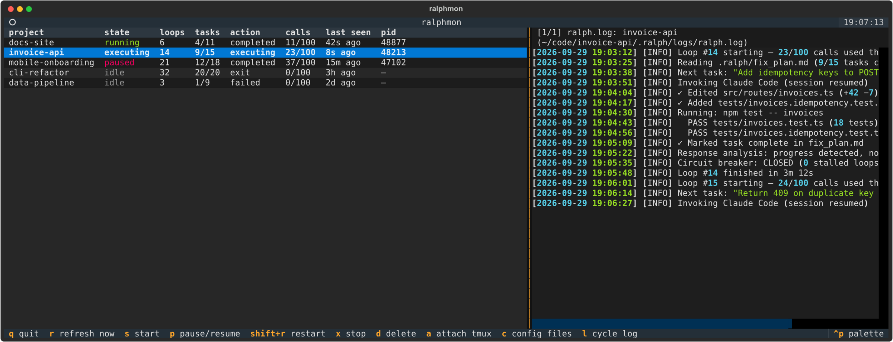
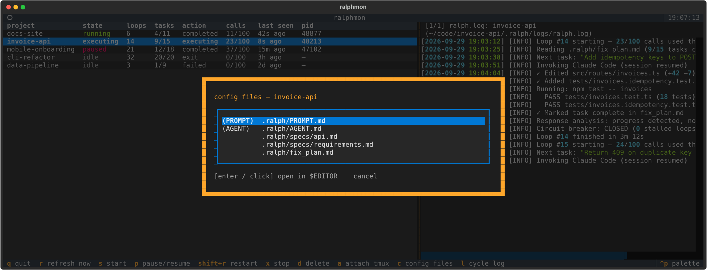
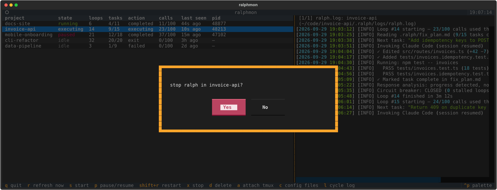

# ralphmon

A minimal terminal dashboard for monitoring and controlling [ralph-claude-code](https://github.com/RalphAI/ralph-claude-code) projects running on your local machine.



## What it does

Open it once and you can see:

- Every project on your machine that has a `.ralph/` directory configured
- Whether each ralph loop is idle, running, executing (mid-Claude call), or paused
- Loop count, API call usage, and time since last status update
- Task progress from `.ralph/fix_plan.md` (checked / total)
- Live-tailing of the project's logs (`ralph.log` by default) in the right pane

And act on any project:

| Key | Action |
|-----|--------|
| `s` | Start ralph (via tmux, headless) |
| `p` | Pause / resume (SIGSTOP / SIGCONT) |
| `Shift+R` | Restart |
| `x` | Stop |
| `d` | Delete `.ralph/` directory (all ralph state) |
| `a` | Attach to the project's tmux session |
| `c` | Pick a config file (PROMPT.md, AGENT.md, specs, …) and open it in `$EDITOR` |
| `l` | Cycle log source (ralph.log → live.log → last Claude output) |
| `r` | Force refresh now |
| `q` | Quit |

Destructive operations (restart, stop, delete) show a confirmation prompt first.

| Config files (`c`) | Confirm before stop / restart / delete |
|---|---|
|  |  |

<sub>Screenshots use synthetic demo projects.</sub>

## Requirements

- Python ≥ 3.11
- [pixi](https://prefix.dev/docs/pixi/overview) (handles all other deps)
- `tmux` (needed to launch ralph headlessly from the dashboard)

## Install

```bash
git clone https://github.com/microblue/ralphmon
cd ralphmon
pixi install
```

Optionally add a symlink so you can run it from anywhere:

```bash
ln -s ~/ralphmon/mon ~/.local/bin/ralphmon
```

## Run

```bash
./mon              # open TUI
./mon --list       # one-shot status table, no TUI
```

## How it discovers projects

Ralphmon walks `$HOME` up to 3 levels deep looking for directories that contain a `.ralph/PROMPT.md` file. The parent directory of `.ralph/` is treated as the project root. It skips `ralph-claude-code` itself (examples), hidden dirs, and common build/dependency dirs.

## Architecture

```
ralphmon/
  core.py     — discovery, status parsing, process control (start/stop/pause)
  ui.py       — Textual TUI (project table + live log pane)
  __main__.py — CLI entry point
mon             — launcher script (runs pixi run python -m ralphmon)
pixi.toml       — workspace config
```

Runtime state is read from:
- `<project>/.ralph/status.json` — loop count, call quota, last action, timestamp
- `<project>/.ralph/progress.json` — whether Claude is currently executing
- `<project>/.ralph/live.log` — real-time streamed output from the running Claude call
- `/proc/<pid>/cwd` (via psutil) — maps running `ralph_loop.sh` processes back to projects

## License

MIT
